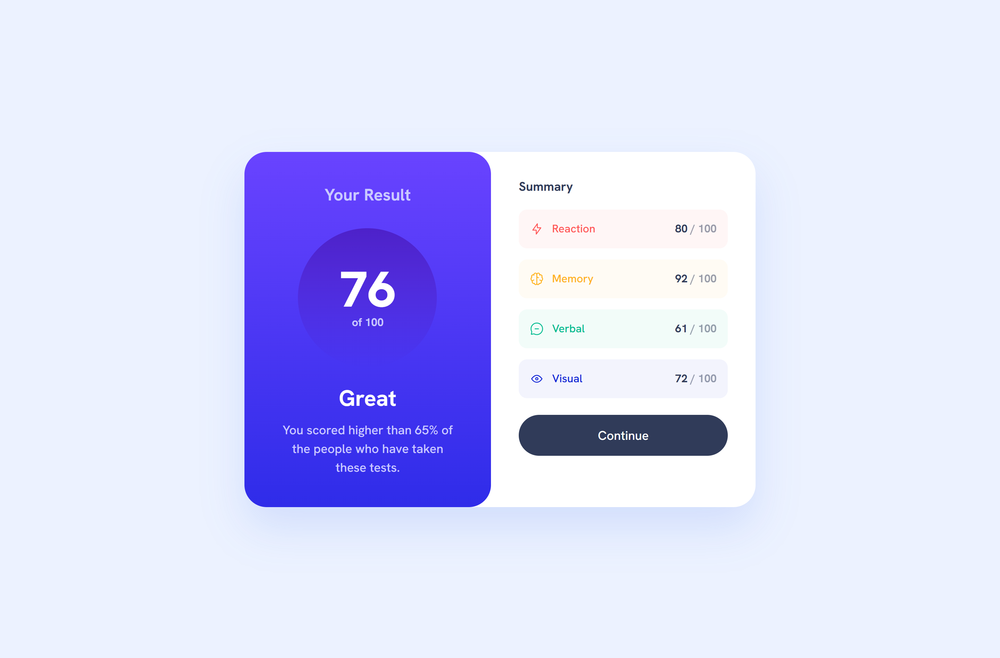

# Frontend Mentor - Results summary component solution

This is a solution to the [Results summary component challenge on Frontend Mentor](https://www.frontendmentor.io/challenges/results-summary-component-CE_K6s0maV). Frontend Mentor challenges help you improve your coding skills by building realistic projects. 

## Summary
In this Frontend Mentor challenge, I built a responsive web page based on a Figma design using a mobile-first approach. I utilized Flexbox for layout and CSS Custom Properties for maintainability and flexibility in design. The main goals were to create a clean, accessible, and responsive layout across all devices.

### The challenge

Users should be able to:

- View the optimal layout for the interface depending on their device's screen size
- See hover and focus states for all interactive elements on the page
- **Bonus**: Use the local JSON data to dynamically populate the content (WIP)

### Screenshot

### Links

- [Link Solution URL](https://www.frontendmentor.io/solutions/result-summary-component-using-vanilla-htmlcss-2Qz3htRYlL)
-  [Link to Live Site](https://heysaminu.github.io/result-summary/)

## My process
Design & Planning: I started by analyzing the Figma design and breaking it into components. The layout was built with a mobile-first mindset, ensuring the mobile experience was solid before scaling to larger screens.

Flexbox: Used for fluid layouts to ensure elements aligned properly across different screen sizes.

CSS Custom Properties: Applied for colors and font sizes to make the code more maintainable and to easily implement design changes.

Responsiveness: Media queries were used to adjust the layout for tablets and desktops, ensuring an optimal experience across all screen sizes.

### Built with

- Semantic HTML5 markup
- CSS custom properties
- Flexbox
- Mobile-first workflow

## Author

- Website - [Saminu E.](https://www.linkedin.com/in/saminu/)
- Frontend Mentor - [@HeySaminu](https://www.frontendmentor.io/profile/heysaminu)
- Twitter - [@heysaminu](https://www.twitter.com/heysaminu)